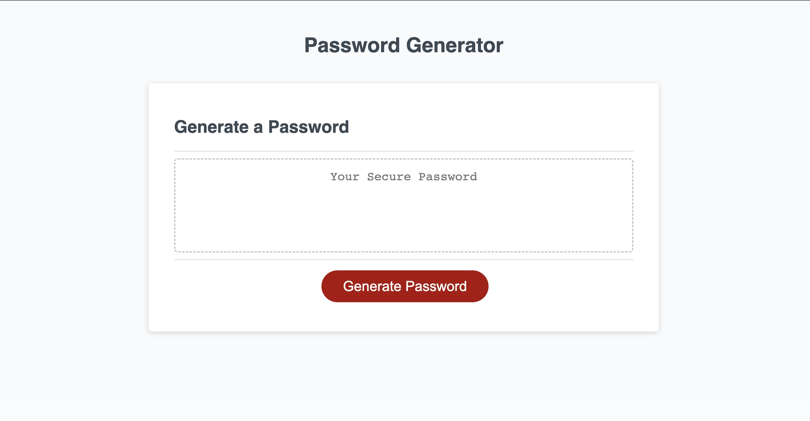

# Random-generator

  

## Description
The code contained within these files are for a random password generator. 
The password may contain between 8 and 128 characters
Those characters may consist of uppercase letters, lowercase letters, numbers or symbols.

  ## Table of Contents

  - [Installation](#installation)
  - [Usage](#usage)
  - [Contributing](#contributing)
  - [License](#license)
  - [Tests](#tests)
  - [Future-Development](#future-development)

  ## Installation

  To install this project, download the files from my repository at https://github.com/Edna1999/Random-generator. Open the html file in your browser to view the app.

  You can also visit the deployed webpage via the following link: https://edna1999.github.io/Random-generator/
  
  ## Usage

  ## Contributing

  - [Edna Omadjambe](https://github.com/Edna1999)

  ## License
  The License being used is: MIT
  If you would like to read more on this please click the badge to navigate to the license page: 
  

  ## Tests

  No tests have been created yet for this project

